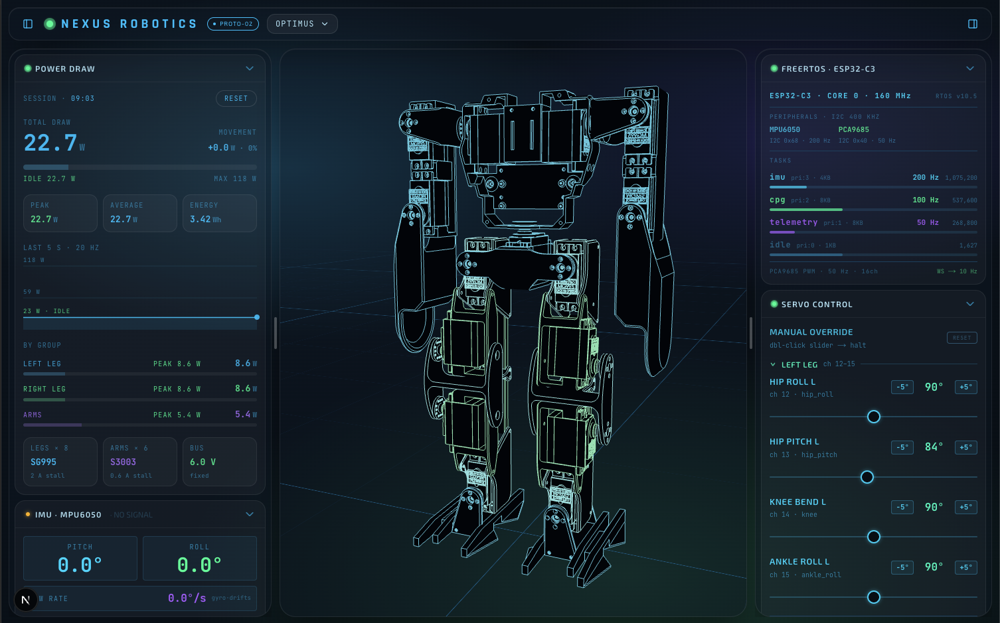

# futurespace-ui

Digital twin for small servo robots: a 3D model you can pose by hand, live telemetry, and two-way control of the real robot from the browser. Ships with **Optimus**, a 14-servo biped with a live robot link, and **Spot Micro**, a 12-servo quadruped in simulation. Any robot with a URDF can be added with a single JSON file.

**Live demo: [robotics.amasetti.com](https://robotics.amasetti.com/robotics)** — runs in the browser as a simulator, no robot needed. Pose the model, build a pose sequence, switch robots; it also works on a phone.



Built with Next.js 16 (App Router), React 19, TypeScript, Tailwind CSS v4 and Three.js.

## Features

- **3D model posed by hand** — hover a part to highlight it, then drag to turn the servo behind it. Linkages such as Optimus' leg parallelograms move together.
- **Servo Control** — one slider per servo with ±5° steps, grouped per limb, mirrored live in the 3D model.
- **Live robot link** — observe the robot's pose, take control to drive it, release to hand it back.
- **Power Draw** — modelled current per servo group with session peak, average and energy, plus a reset.
- **IMU, FreeRTOS and Model panels** — shown only for robots whose definition describes that hardware.
- **Pose timeline** — build motions as a sequence of poses with editable transition times, play them once or in a loop, and export them for your own programs.
- **Glass layout** — frosted sidebars you can resize (drag the pill grip, double-click to reset) and hide from the header; widths, pose, camera and robot choice are remembered.
- **Phone layout** — the same features on a phone: the viewer on top and every panel, timeline included, in one bottom sheet you resize with its pill and hide from the header.

## Getting started

```bash
npm install
npm run dev        # http://localhost:3000/robotics
```

Without a robot everything works as a simulator: pose the model, read the power model, switch robots. To connect to Optimus, run the Docker stack (below) or point the UI at the robot with `NEXT_PUBLIC_ROBOT_HOST`.

| Variable                 | Default                | Purpose                                                      |
| ------------------------ | ---------------------- | ------------------------------------------------------------ |
| `NEXT_PUBLIC_ROBOT_HOST` | `optimus.local`        | Robot firmware WebSocket host (port from `robot.json`)       |
| `NEXT_PUBLIC_ROS_WS_URL` | `wss://localhost:9090` | rosbridge URL — baked in at build time, rebuild after change |

## Scripts

```bash
npm run dev               # Dev server with hot reload
npm run build             # Production build (standalone)
npm run check             # tsc + eslint + robot definition validation
npm run validate:robots   # Check every robot.json against its URDF
npm run format            # Prettier
```

## Robots

Each robot is a folder in `public/models/<id>/` with its URDF, meshes and a `robot.json` that drives the whole UI for it. The robot picker in the header lists the ids in `public/models/index.json`.

`robot.json` declares the servos (required) and, optionally, the hardware the UI knows about. Each panel appears only when the file defines what it needs:

| Panel         | Needs                                                      | Optimus | Spot Micro |
| ------------- | ---------------------------------------------------------- | :-----: | :--------: |
| Servo Control | `servos` (required)                                        |    ✓    |     ✓      |
| Model         | always — counts come from the URDF, `sim` adds settings    |    ✓    |     ✓      |
| Power Draw    | `power.busV` and a `type` from `servoTypes` on every servo |    ✓    |     ✓      |
| IMU           | `imu` and a `link` (its data comes from the robot)         |    ✓    |            |
| FreeRTOS      | `mcu.rtos`                                                 |    ✓    |            |
| Take Control  | `link` — live WebSocket/ROS connection to the robot        |    ✓    |            |

Each servo lists the URDF joints it turns as `urdf = scale · servo + offsetDeg`, so signs, offsets and linkages (several joints per one servo) are data, not code:

```jsonc
{
  "id": "l_hip_pitch", // firmware joint name for robots with a link
  "label": "Hip Pitch L",
  "group": "Left Leg",
  "channel": 13,
  "limitsDeg": [-90, 90],
  "joints": [
    { "joint": "Unactuated-Knee-L-Top", "scale": -1 },
    { "joint": "Unactuated-Tendon-L-Top", "scale": -1 },
    { "joint": "Servo-Knee-L-Top", "scale": 1 },
  ],
  "pivot": "Unactuated-Knee-L-Top", // where the part turns when dragged in 3D
  "type": "SG995",
}
```

**Adding a robot:**

1. Copy its URDF and meshes into `public/models/<id>/`, with mesh paths relative to the URDF.
2. Write `robot.json` — [`spotmicro/`](public/models/spotmicro/robot.json) is a servos-only example, [`optimus/`](public/models/optimus/robot.json) uses every section.
3. Add the id to `public/models/index.json`.
4. Run `npm run validate:robots`. It checks the file against the schema in [`lib/robot-def.ts`](lib/robot-def.ts) and every joint and mesh against the URDF. CI runs it too.

## Pose timeline

The bar under the 3D view holds an animation — a named sequence of poses — for the current robot.

- The sliders and 3D drag edit the **selected** pose — pose 1 by default. **+** adds a pose that starts as a copy of the last one; hovering any pose shows a button to append a copy of it — handy for repeating moves like a wave. Drag a pose to reorder it (it keeps its own transition time); whichever pose is first is the start.
- The field between two poses is the transition time in seconds. Joints move between poses along a sigmoid curve — slow start, slow arrival — so the servos have time to settle.
- **Play** runs the sequence once; with **Loop** on it returns to pose 1 (the `↺` field sets that return time) and repeats. Playback only moves the model, never the real robot.
- The animation is saved in the browser per robot. **Export** downloads it as `<robot>_<name>_sequence.json` (e.g. `optimus_wave_sequence.json`); **Import** loads one back, taking its name from the file's `name` field or, if missing, from that file-name pattern.

Exported files are meant to be replayed by a program:

```jsonc
{
  "format": "nexus-pose-sequence",
  "version": 1,
  "robot": "optimus",
  "name": "wave",
  "angleUnit": "rad", // around each servo's zero — what the robot link sends as set_joints
  "interpolation": { "type": "sigmoid", "k": 10 },
  "loop": true,
  "durationS": 3,
  "servos": [{ "id": "l_hip_roll", "label": "Hip Roll L", "channel": 12, "limitsDeg": [-90, 90] }],
  "poses": [{ "name": "Pose 1", "timeS": 0, "durationS": 1, "angles": { "l_hip_roll": 0.17453 } }],
  "trajectory": { "hz": 50, "servoOrder": ["l_hip_roll"], "frames": [[0.17453]] },
}
```

`trajectory.frames` is the whole motion pre-sampled at 50 Hz — one row per tick, angles in `servoOrder` — so a player can stream it to the servos without reimplementing the curve. To interpolate the keyframes yourself, each joint follows `a + (b − a) · s(u)`, where `u` is the fraction of the transition elapsed and `s` is the logistic `1 / (1 + e^(−k(u − ½)))` rescaled to run from 0 to 1.

## Live robot link

Optimus' firmware exposes a WebSocket on port 81. It is plain `ws://`, so the link only runs when the UI is served over HTTP — locally or from the Docker stack. Served over HTTPS (a hosted demo) the UI skips it and works as a simulator. The UI reaches the robot two ways:

```
Robot (ESP32-C3) ── ws://optimus.local:81 ──┬──────────────────────────────▶ Browser (lib/robot-ws.tsx)
                                            │                                  IMU, servo state, set_joints
                                            ▼
                              ros2-bridge (ROS 2 Humble)
                                /optimus/joint_states, /optimus/imu/*  ◀── publishes
                                /optimus/cmd/joint                     ──▶ subscribes
                                            │
                                            ▼
                              rosbridge  wss://:9090 ───────────────────────▶ Browser (lib/ros.tsx)
```

| Mode                  | Behaviour                                                                                                                                                                                         |
| --------------------- | ------------------------------------------------------------------------------------------------------------------------------------------------------------------------------------------------- |
| **Observe** (default) | Sliders and the 3D model follow the robot's live joint positions. Read-only.                                                                                                                      |
| **Override**          | **Take Control** makes sliders and 3D drag interactive; each released slider or drag is sent to the robot. **Copy Pose** exports the pose as firmware `#define`s. **Release Control** hands back. |

Topic names, the WebSocket port and the Copy Pose target all come from the `link` section of `robot.json`.

## Docker

The full stack — rosbridge and this UI — runs from the NexusRobotics workspace's `docker/compose.yml`:

```bash
make docker-ip     # resolve optimus.local → ROBOT_IP in docker/.env
make docker-up     # UI → http://localhost:3001/robotics
```

rosbridge uses a self-signed TLS certificate generated on first boot. Open `https://localhost:9090` once, accept the certificate, and reload the UI.

## Project structure

```
app/
  robotics/page.tsx         # Robotics view: robot picker, sidebars, live link
  showcase/page.tsx         # Every HUD component, for visual reference
components/hud/
  core/                     # HudPanel (+ glass surface), badges, labels, status dots
  panels/
    GlassSidebar.tsx        # Resizable, hideable frosted sidebar
    ServoControl.tsx        # Sliders generated from robot.json
    PowerConsumption.tsx    # Power model from robot.json servo types
    PoseTimeline.tsx        # Pose sequence editor and player
    GlassBottomSheet.tsx    # Phone layout: every panel in one resizable bottom sheet
  visualization/
    MujocoViewer.tsx        # URDF viewer, drag-to-turn, Model panel
lib/
  robot-def.ts              # robot.json schema, validation, panel rules
  sequence.ts               # Pose sequences: sigmoid interpolation, export/import
  use-robot-defs.ts         # Loads index.json and every robot.json
  robot-ws.tsx, ros.tsx     # Robot link: firmware WebSocket and rosbridge
  persist.ts                # localStorage: sequences, camera, sidebars, robot
public/models/
  index.json                # Robots shown in the picker
  optimus/, spotmicro/      # URDF + meshes + robot.json per robot
scripts/validate-robots.mjs # CI check for robot definitions
```

## Contributing

Every commit is checked locally by [husky](https://typicode.github.io/husky/):

- **pre-commit** ([`.husky/pre-commit`](.husky/pre-commit)) — ESLint (no warnings allowed) and Prettier on the staged files, then `tsc` on the whole project.
- **commit-msg** ([`.husky/commit-msg`](.husky/commit-msg)) — the subject must follow [Conventional Commits](https://www.conventionalcommits.org/).

CI runs the same lint and type checks, plus robot validation and a production build. Pull requests use the [template](.github/pull_request_template.md).

## Releases

Every push to `main` runs [`release.yml`](.github/workflows/release.yml), which picks the next version from the commits since the last `vX.Y.Z` tag:

| Commit                                    | Bump  | Example                        |
| ----------------------------------------- | ----- | ------------------------------ |
| `type!:` or a `BREAKING CHANGE:` footer   | major | `refactor!: drop roslib`       |
| `feat`                                    | minor | `feat(sliders): ±step buttons` |
| `fix`, `perf`, `refactor`                 | patch | `fix(viewer): joint signs`     |
| `chore`, `ci`, `docs`, `style`, `test`, … | none  | no release                     |

The release ships `futurespace-ui-vX.Y.Z.tar.gz` — the standalone Next.js bundle. Extract it and run `node server.js` (port via `PORT`, default 3000).

## Credits

Spot Micro meshes by KDY0523, licensed CC BY 3.0 — see [`public/models/spotmicro/ATTRIBUTION.md`](public/models/spotmicro/ATTRIBUTION.md).
